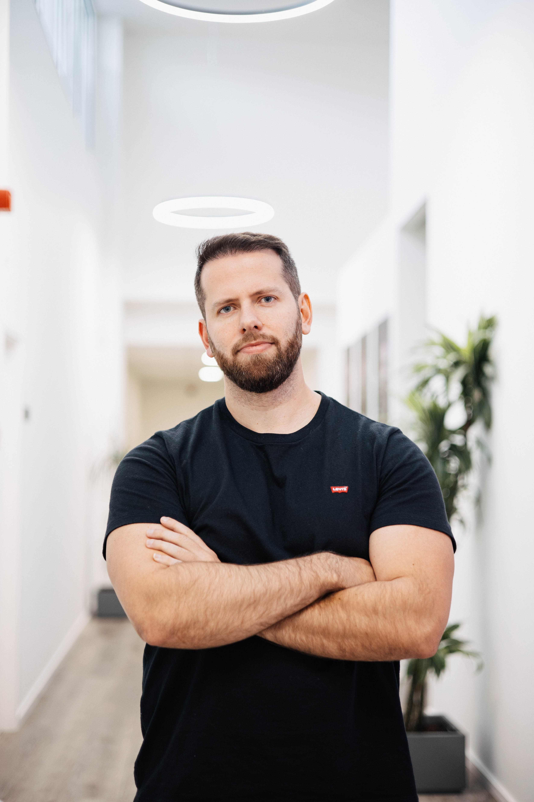
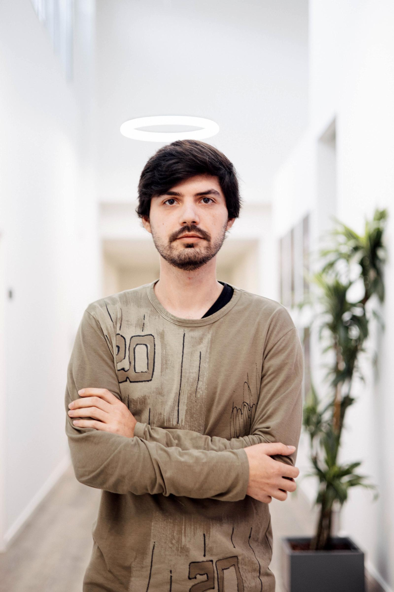

<h1 align="center"><a href="https://licinio14.github.io/rvs">Open the site!!!</a><h1>

# 
RVS - Style Meets Comfort

  
  
  

## Algumas coisas que dao para fazer no site:

RVS is more than just a clothing brand—it's a story of friendship, determination, and creative passion brought to life. Born from the collaborative vision of three software developers turned fashion innovators, RVS represents the perfect fusion of technology and style.

-Temos o login que pode usar qualquer nome(qualquer um), email(ex: a@a.com) e password(qualquer uma) para entrar e ficara a mustrar o nome enquanto navega pelo site; 
-Se usar o login, carregando no nome vai para uma nova pagina que mostra a informação da conta e da para fazer logout; 
-Pode adicionar produtos ao carrinho; 
-Efectuando a compra no carrinho direciona para a pagina de pagamento onde so necessita de preencher os campos com informaçoes validas(caso aja erros mostra uma label a vermelho); 
-Tanto os baners como os cards e o carrancel da pagina home, levam para paginas que nao se encontram dentro do menu(top products, sales, new arrivals); 
-Preenchendo o formulario de contacto leva para a pagina de envio bem sucedido.

## 🌟 About RVS

RVS is more than just a clothing brand—it's a story of friendship, determination, and creative passion brought to life. Born from the collaborative vision of three software developers turned fashion innovators, RVS represents the perfect fusion of technology and style.

### 💫 Our Story

The name RVS emerges from the founders' surnames (Rio, Vale, Sousa), symbolizing the unique bond that sparked this creative venture. What began as a shared dream during a software development course has evolved into a dynamic fashion brand dedicated to self-expression and individual style.

### 🎯 Our Vision

At RVS, we bring the precision of software development into fashion design:
- Modern and versatile collections
- Sustainable manufacturing processes
- Quality-focused production
- Technology-inspired designs
- Innovative approach to fashion

## 👥 Meet Our Team

  
  
  

  <strong>Gonçalo Rio • Ana Vale • Licínio Sousa</strong>

## 🚀 Features

- 👕 High-quality clothing collections
- 🎨 Innovative designs
- 💻 Tech-inspired aesthetics
- ♻️ Sustainable materials
- 🌍 Global shipping
- 🤝 Community-driven approach

## 📸 Our Brand

  

## 📫 Contact Us

- Email: contact@rvs-fashion.com
- Instagram: [@rvs_fashion](https://instagram.com/rvs_fashion)
- Twitter: [@RVS_Fashion](https://twitter.com/RVS_Fashion)

---

Built with ❤️ by the RVS Team
